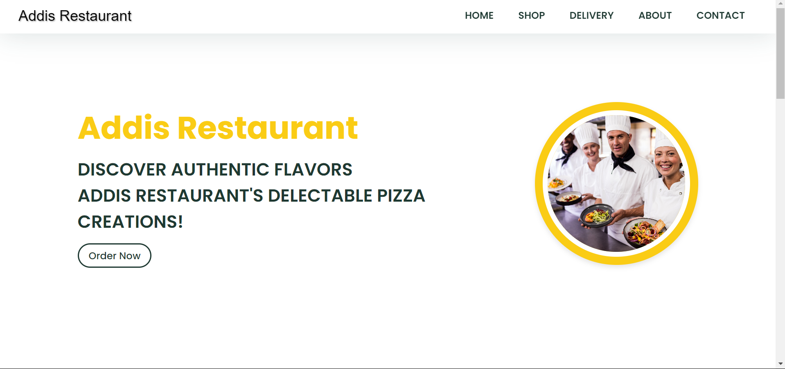

<h1 align="center">Home page</h1>

<h1 align="center">Order page</h1>

<h1 align="center">Deliver page</h1>

<h1 align="center">About page</h1>

<h1 align="center">Contact page</h1>

<h1>Key Features: </h1>

- 🍕 Responsive Design: The website adapts seamlessly to various screen sizes, ensuring accessibility for all users, whether on desktop, tablet, or mobile.

- 🍕 Mouthwatering Visuals: It incorporated delicious visuals that showcase the essence of Addis Pizza's offerings, creating an enticing and visually appealing experience.
  
- 🍕 Easy Navigation: The menu is intuitive and user-friendly, allowing visitors to explore and special offerings effortlessly.
  
- 🍕 Interactive Elements: Engage with our interactive features that provide a delightful experience, such as hovering over pizzas for details and clicking for quick orders.
  
